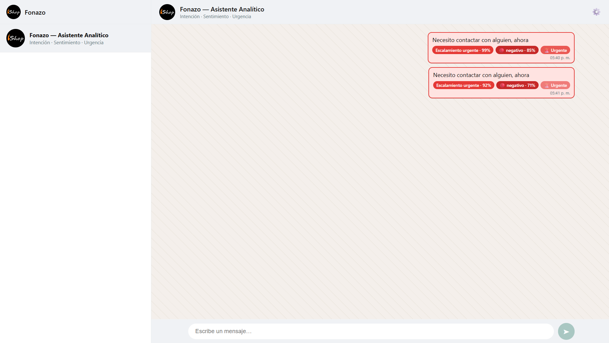
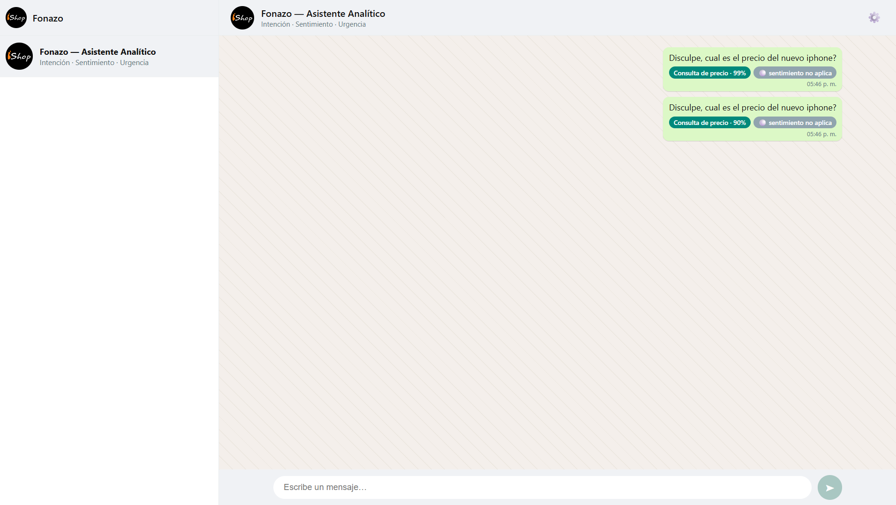

# Asistente Analítico NLP para E-commerce

> Clasificación automática de **intención**, **sentimiento** y **urgencia** en mensajes de clientes de e-commerce, usando NLP en español. Proyecto académico desarrollado para el caso **Fonazo**.


-FFD21E?logo=huggingface&logoColor=black)


---

## 🎯 El problema

Un negocio de e-commerce recibe cientos de mensajes de clientes sin estructura: consultas, reclamos, dudas de envío, etc. Leerlos y priorizarlos uno por uno es lento y no escala.

Este proyecto automatiza la **categorización de mensajes no estructurados** para que el equipo de atención pueda:

- 🏷️ **Detectar la intención** del cliente (clasificación multiclase, 8 categorías).
- 😊 **Analizar el sentimiento** del mensaje (binario: positivo / negativo).
- 🚨 **Identificar la urgencia** para priorizar los casos que necesitan escalamiento.

Todo pensado para **stakeholders no técnicos**, mediante una interfaz de chat sencilla.

---

## 📊 Resultados

| Tarea | Modelo | Métrica |
|-------|--------|---------|
| **Intención** (8 clases) | **BETO** (fine-tuning) | **F1-macro 0.888** (holdout real, la validación más confiable) |
| **Intención** (8 clases) | SVM + TF-IDF | F1-macro 0.783 |
| **Sentimiento** (binario) | **BETO** (fine-tuning) | F1-macro ≈ 0.82 · ROC-AUC 0.911 |

El modelo basado en Transformers (**BETO**, BERT en español) superó de forma consistente a los baselines clásicos (SVM + TF-IDF).

### 🗂️ Dataset híbrido

- **~200,000 reseñas** de e-commerce en español (Amazon ES) para el pre-entrenamiento del clasificador de sentimiento.
- **143 mensajes reales** de clientes recolectados para el caso Fonazo (115 para entrenamiento, 28 como *holdout* de validación nunca visto por los modelos).

---

## 🖥️ La aplicación

Interfaz de **chat estilo WhatsApp Web** (React + Vite) que permite probar los modelos en vivo: se escribe un mensaje como si fuera un cliente y el sistema devuelve su intención, sentimiento y nivel de urgencia. El diseño imita la UI de WhatsApp (colores, burbujas de mensaje) para que la demostración sea intuitiva para usuarios no técnicos.

El frontend consume una **API REST en FastAPI** que sirve la inferencia de los modelos entrenados.

### 📸 Demo

| Detección de urgencia | Clasificación de intención |
|:---:|:---:|
|  |  |
| *"Necesito contactar con alguien, ahora"* → **Escalamiento urgente 99%**, sentimiento negativo, marcado como **Urgente**. | *"¿Cuál es el precio del nuevo iPhone?"* → **Consulta de precio 99%**, sentimiento no aplica. |

---

## 🛠️ Stack tecnológico

| Categoría | Tecnología |
|-----------|-----------|
| Lenguaje | Python · JavaScript |
| NLP / ML | Hugging Face Transformers (BETO), scikit-learn (SVM, TF-IDF) |
| Backend | FastAPI · Uvicorn |
| Frontend | React + Vite · Nginx |
| Contenedores | Docker · Docker Compose |
| Análisis | Jupyter Notebooks · Pandas |

---

## 🧩 Arquitectura

```
┌──────────────────┐     ┌────────────────────┐     ┌──────────────────────┐
│  Frontend        │────▶│  Backend           │────▶│  Modelos entrenados  │
│  React + Vite    │ API │  FastAPI (Uvicorn) │     │  BETO · SVM/TF-IDF   │
│  (chat WhatsApp) │     └────────────────────┘     └──────────────────────┘
└──────────────────┘
```

```
code/
├── back/         → API FastAPI + modelos (intención, sentimiento, preprocesamiento)
├── front/        → interfaz React + Vite (chat)
├── notebooks/    → EDA, entrenamiento y evaluación
├── resultados/   → métricas y salidas
└── docker-compose.yml
```

---

## 👤 Mi rol

Proyecto en **equipo de 3**. El **EDA y la limpieza de datos** los realizaron mis compañeros; a partir de los **datos limpios** yo me encargué de:

- 🧠 **Modelado y entrenamiento**: implementación de los **modelos base** (SVM + TF-IDF) y el **fine-tuning de BETO** para intención y sentimiento.
- ⚙️ **Backend**: descarté una primera opción en Streamlit e implementé una **API en FastAPI** con su **Dockerfile** para servir la inferencia.
- 💬 **Frontend**: desarrollé la interfaz de **chat estilo WhatsApp Web** en **React + Vite**, tomando como referencia el diseño de WhatsApp para simular la conversación con el cliente.

---

## 🚀 Ejecución local

### Opción A — Docker (recomendada)

```bash
git clone https://github.com/lvanCR/CC219-TP-TF-2026-1-CC92.git
cd CC219-TP-TF-2026-1-CC92/code
docker compose up --build
```

Esto levanta el backend (FastAPI) y el frontend (React + Nginx) juntos.

### Opción B — Manual

**Backend:**
```bash
cd code/back
pip install -r requirements.txt
uvicorn main:app --reload
```

**Frontend** (en otra terminal):
```bash
cd code/front
npm install
npm run dev
```

---

## 👥 Créditos

Proyecto desarrollado en la **Universidad Peruana de Ciencias Aplicadas (UPC)** por:

- José Agustín Valdivia Guzmán
- Eduardo Fernando Bravo Lévano
- Iván Rubén Cunyas Ramos

## 📄 Licencia

Distribuido bajo licencia **MIT**.
